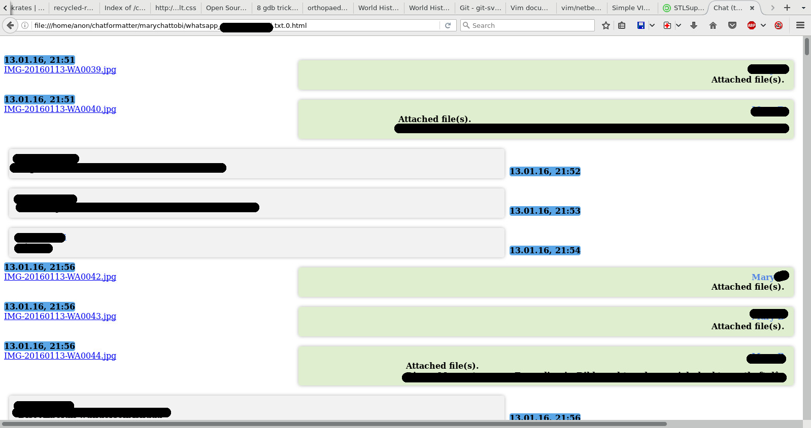

Chatformatter
===

Convert chat in text format (e.g. WhatsApp export to email) to styled HTML file(s).
---

    cd $HOME
    git clone http://github.com/faerietree/chatformatter.git 
    cd $HOME/chatformatter
    python convert.py /writable/path/to/chat.txt
    
Open in browser:

    firefox /writable/path/to/chat.txt.0.html &

Example output
---

